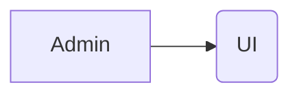
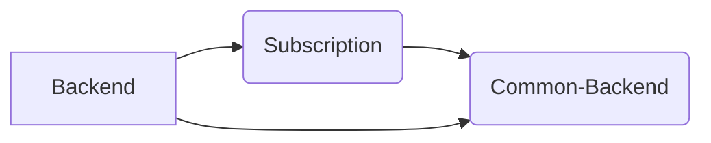

# A Full Stack starter kit

Full-Stack starter kit is your starter monorepo for building apps both in  **NodeJs** and **React**.
Monorepo is setup using the dev tool [nx.dev](https://nx.dev/). We can create multiple apps and libraries via nx.dev and use them in different applications and publish npm packages.

# Tables of Content

 - Getting started
 - Built with
 - Packages
	 - :rocket: [Admin](#Admin)
	 - :rocket: [Backend](#Backend)
	 - :package: [Common-Backend](#Common-Backend)
	 - :package: [Subscription](#Subscription)
	 - :package: [UI](#UI)

## Getting Started

Instruction to run the app
> **Note:** Sample instructions

## Built With

 - nx.dev
 - nestjs
 - next.js
 - tsdx
 - inversify
 - commitizen
 - commit-lint
 - husky
 - prettier
 - eslint
 - cz-ccgls
 - docker-compose
 - envoy (grpc proxy)
 - verdaccio (private package repository)

## Packages

Library consist of 5 packages

### :rocket:[Admin](https://github.com/asimashfaq/fullstack-starter/tree/master/packages/admin)
Admin panel dashboard

#### Features

 - Internalization
 - Grpc
 - Server sider rendering
 - Theme Switcher

#### Build With

 - NextJs
 - Typescript
 - StyledComponents
 - Tailwindcss
 - Redux-Toolkit
 - Redux-Observable
 - Redux-Epics
 - Redux Dev Tools
 - Epics
 - Rxjs
 - Typesafe-Actions
 - Redux-Logger
 - Postcss

### :rocket:[Backend](https://github.com/asimashfaq/fullstack-starter/tree/master/packages/backend)

Backend Server provide api interface in **Graphql** and **Grpc**. Use  **Inversify.js**  (a dependency injection tool) to inject the (business logic layer + database layer) into the app imported via libraries or packages.

In this monorepo we import the **Subscription** library  which implemented the `Services` and `Database` Interface provided by the **Common-Backend**. User can interact with Subscription Library via Grphc and Graphql interface provided in the Backend application via NestJS farmework.

#### Apis
 - Subscription
#### Build With
 - Typescript
 - NestJS
 - Inversify
 - Grpc-Tools
 - Pbts

### :package:[Common-Backend](https://github.com/asimashfaq/fullstack-starter/tree/master/packages/backend)
Provide Generic interface and types for
 - Database
 - Config
 - Service
 - Pagination
 - Errors
 - Logger

Also implemented the common functions that can be used in verious libraries/app build using common-backend.
In our case its used in **Subscription** Library and in **Backend** app.

#### Build With

 - Typescript
 - Inversify
 - Tsdx
 - Bunyan

### :package:[Subscription](https://github.com/asimashfaq/fullstack-starter/blob/master/packages/subscription)
Implement the Subscription Service base on the Service interface provided by `Common-Backend`.
Implement all the business logic , validation and database layer in it. Also Implement the Database Service base on interface provided by `common-backend` It save infromation in the **RavenDB**.

> Note: Also implement the unit testing . You can run the project as the standalone library without having any kind of transport layer.

#### Features

 - Add
 - Update
 - Delete
 - List

#### Build With

 - Typescript
 - Raven DB
 - Inversify
 - Tsdx
 - Yup

### :package:[UI](https://github.com/asimashfaq/fullstack-starter/blob/master/packages/ui)
UI is the library of different UI elements build from sacratch or write wrappers on top of 3rd parties libraries.
We can use UI elements in different apps and built our UI on top of it.

#### UI Element and 3rd Party Wrappers
 - Background
 - Button
 - Dashboard
 - Dropdown (popper.js)
 - Header
 - Hooks
 - Icon
 - Input (formik)
 - Notifiaction
 - Table (react-table)
 - Sidebar
 - Theme-Switcher

#### Build With

 - Typescript
 - Storybook
 - React
 - Tsdx
 - Yup
 - Framer-Motion
 - ahooks
 - Styled-Components
 - popper.js
 - formik
 - react-icons
 - react-table
